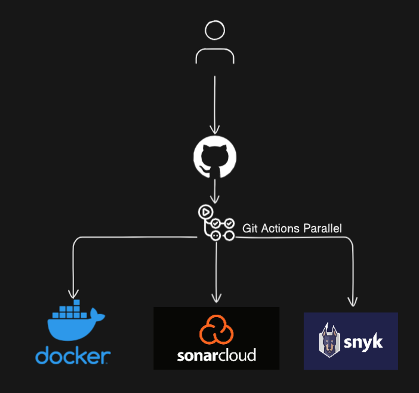

# Security Analysis CI Project with SCA and SAST Tools  
   
This project integrates a continuous integration (CI) pipeline with Software Composition Analysis (SCA) and Static Application Security Testing (SAST) tools. The pipeline is written in GitHub Actions and uses SonarCloud, Snyk, and Docker Scout to ensure code quality and security.  

## Recommendations for Using this Project  

### General

- If there is no dependency between jobs, prefer to run them in parallel to decrease pipeline execution time.     
- Developers are recommended to use an SCA add-on for their IDE or code editor. This allows potential issues to be addressed during the coding phase, before code is committed.     
- We recommend using a secret scanner such as pre-commit. This tool can be configured with a set of rules to help developers avoid committing code with security vulnerabilities.
- If security tools detects issues, it should prevent the merge of the Pull Request. (Continue-on-fail=FALSE)
- If the pipeline part of version release, recommend to use environments: Production, Staging, Development.
- Implement notifications -> e.g: Send an email if the build failed.

### Docker  
   
- We recommend using the latest, most updated "official" images for your Docker containers.  
- Consider using the Alpine Linux distribution for your images. It's simple, fast, secure, and minimal, with few dependencies. Distroless images are also recommended for their minimal design.  
- Use Docker Scout with the command `cves imagename:tag` to check for critical Common Vulnerabilities and Exposures (CVEs).  
   
By following these recommendations, you can maintain a high standard of code quality and security in your project while taking advantage of the efficiency and automation provided by the CI pipeline.  
   
## Tools Used  
   
- [SonarCloud](https://sonarcloud.io/) SCA - for continuous code quality inspection and security hotspot detection.  
- [Snyk](https://snyk.io/) SAST - for dependency checking and vulnerability scanning.  
- [Docker Scout](https://github.com/nuxi-tech/docker-scout) for scanning Docker images for known vulnerabilities.  
